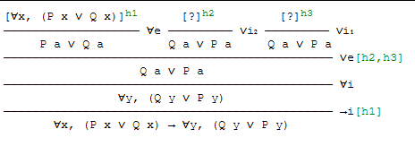

# Exam - 2019
## Question 1
$not P/\not R$
As we would have to prove either Q or S in the implication, or T or S.

## Question 2
The empty set is a part of C, so the intersection will be the empty set.

The above is wrong

The cartesian product of an empty set is an empty set, as it contains no elements, so there won't be an a.

## Question 3
The second answer

## Question 4
The second

## Question 5
The 3rd

## Question 6
Injective not surjective.
A f o g relation, has to have both sides be the same, so since f and g are both injective, but none are surjective, f o g is injective not surjective

## Question 7
Start by creating two scenarios:
$$
	\text{hymn}, [], [], [], []\\
	[], [], [], [], []
$$
So all performances with a hymn and all without one. Then calculate the remainin seats uusing combinations:
$$
	\frac{n!}{r!(n-r)!} = \frac{8!}{4!(8-4)!} = 70\\
	\frac{8!}{5!(8-5)!} = 56
$$
Then we remember there is that there is two hymns so the total number of song combinations are: 
$$
	70+70+56 = 196
$$
Now calculate the number of permutations of 5 with
$$
	n! = 5! = 120
$$
Times that with our combinations
$$
	120 * 196 = 23520
$$

## Question 8
Let event A be that the alarm goes off.
Let event B1 be that there is a break in. Let B2 then be that there isn't a break in.
$$
	P(B_1) = 10\% = 0.10\\
	P(B_2) = 90\% = 0.90 
$$
Then when the burglar breaks in there is a 99\% chance he will trip it:
$$
	P(A|B_1) = 99\% = 0.99
$$
And when it's not a break in there is a 3\% chance the home owners will trip it:
$$
	P(A|B_2) = 3\% = 0.03
$$
We then use Bayes theorem:
$$
	\frac{P(A|B_1) \cdot P(B_1)}{P(A|B_1)\cdot P(B_1) + P(A|B_2)\cdot P(B_2)} = \frac{0.99 \cdot 0.10}{0.99 \cdot 0.10 + 0.03\cdot 0.90} = 0.7857 = 78.57\%
$$

## Question 9
There are to connected components, as {a,b,c,d,e} are all connected to each other and {f} is on it's own, There are not equivalence classes as all the elements are directly related to each other.

## Question 10
It's a finite state automaton, meaning it has to end, so the last node is completly useless. You can end on the first point, so lambda has to be an option. Then you go {a, as many c's you want, a} or {b,c,{as many a or b's you want}}, leaving only the last one.

## Question 11
By testing it's the second one.
1. Gives  11 when n=3
2. Follows
3. Gives 13 when n=3
4. Gives 12 when n=4

## Question 12
### Part a

### Part b
Only to be used in the current branch of the tree

## Question 13
Prove the base case n=2
$$
	2^2 < (2+1)! = 4 < 6
$$

Create our inductive hypothesis:
$$
	2^k < (k+1)!
$$

If P(k) is true, then so is P(k+1):
$$
	2^{k+1} < ((k+1)+1)!
$$

Induction:
$$	
	2^{k+1} < (k+2)!\\
	\intertext{Move k+1 out, and simplify 2^{k+1}}
	2\cdot 2^{k} < 2(k+1)!\\
	\intertext{Since k > 0, 2 < k+2 is true, so we can (Abuse larger than):}
	2\cdot 2^{k} < (k+2)(k+1)!\\
	\intertext{By factorial (k+2)*(k+1)! is the same as:}
	2\cdot 2^{k} < (k+2)!\\
	\intertext{Which is:}
	2\cdot 2^{k} < ((k+1)+1)!\\
$$
Therefore P(k+1) holds.

