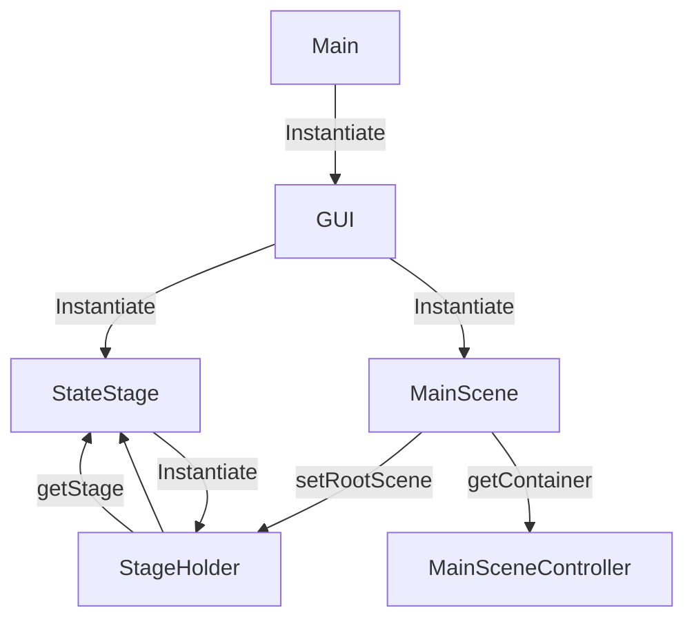
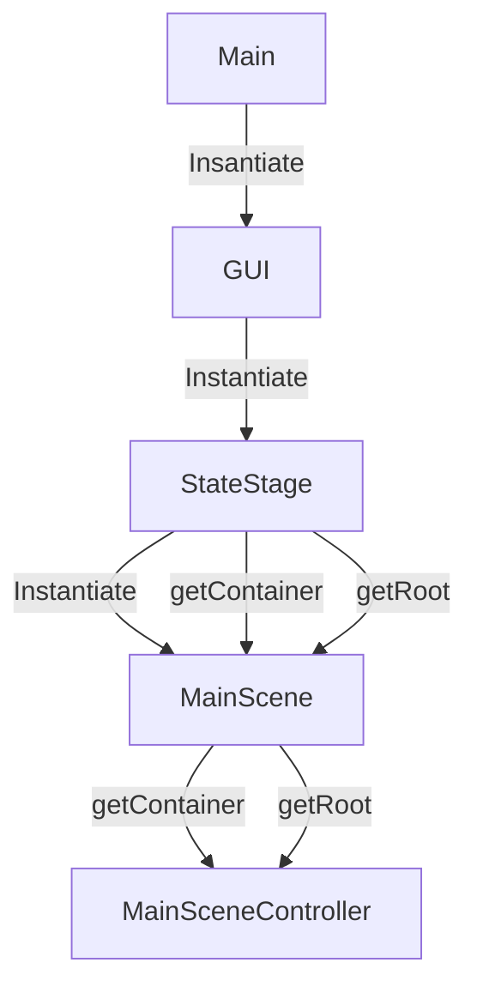

# GUI flow

## Old

```mermaid
graph TD
	A[Main] -->|Instantiate| GUI;
	GUI -->|Instantiate| StateStage;
	GUI -->|Instantiate| MainScene;
	MainScene -->|getContainer| MainSceneController;
	MainScene -->|setRootScene| StageHolder --> StateStage;
    StateStage -->|Instantiate| StageHolder;
    StageHolder -->|getStage| StateStage
```

## New

```mermaid
graph TD
	A[Main] -->|Insantiate| GUI;
	GUI -->|Instantiate| StateStage;
	StateStage -->|Instantiate| MainScene;
	StateStage -->|getContainer| MainScene;
	StateStage -->|getRoot| MainScene;
	MainScene -->|getContainer| MainSceneController;
	MainScene -->|getRoot| MainSceneController;
```

