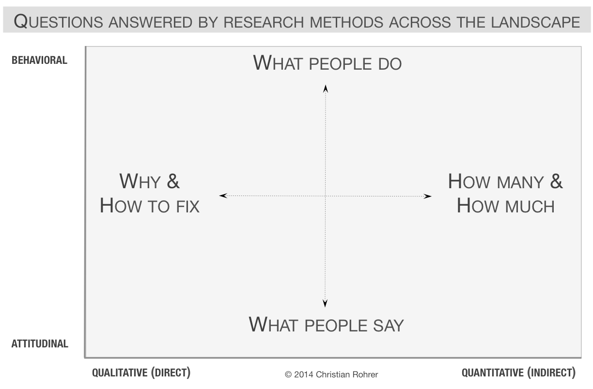

# Lesson 2 - Design metoder og informationsarkitektur
## What is user experience development
- Making sure that nothing happens without your intent
- Every action possibility taken into account
- Understanding user expectations during those actions

## Elements
### Plane
Planes are layers of the user experience, there are five distinct layers of user experience
- Surface
	- The surface is what is see, image, text, things to click on and so on.
- Skeleton
	- The placement of elements, or structure, of the user experience. Elements are placed for maximum effect, such as placing the elements in familiar places, or to draw the users eyes to certain spots
- Structure
	- The structure of the page, how the user got there, and where they should go. 
	- The skeleton is the netflix browsing of categories. The structure is what those categories are
- Scope
	- The scope of the site. A book shop is not going to sell you a drill. Size and features also fall under here, such as the ability to save the cart, favorite elements etc. whether those elements are included is a matter of the site's scope.
- Strategy
	- What the designers and users want out of the site. Directly determines scope.
	- Ex. We want to rent you a bike, you want to rent a bike.

These elements are put together in the following order: Strategy, Scope, Structure, Skeleton, Surface. Coincidentally that is also the order of abstraction, from least to most.

While each layer is dependent on each other, completing them in a linear fashion, is literally the concept of the waterfall model, which is a nogo. So instead one should aim to COMPLETE the face, before COMPLETING the next phase. Notice the difference, in completing before completing, not completing before starting. This allows for backpeddaling or reavulating certain decisions, which will impact the next phase.

#### Plane terms
In the scope of a software project, imagine a slice down the middle of the previously discussed stack. The software side of that stack has a few specific elements, listed here:
- Strategy
	- User needs: The goals of the site, from outside the developers, aka the users
	- Site objective: Business goals or reach of the site
- Scope
	- Functional specifications: Detailed description of the sites features, adapted from the strategy
	- Content requirements:  Description of the content of the site, such as books of varying categories
- Structure
	- Interaction design: How the system reacts to user inputs
	- Information architecture: Placement of content on the site
- Skeleton
	- Information design: How information is presented
	- Interface design: How the user interacts with the system
	- Navigation design: The elements that allow the user to navigate the architecture. Such as searching for categories, and clicking one on an already existing product
- Surface
	- Visual design: The look of the product, read: css

## Lean UX
A method for constructing and doing projects.

Useful when using agile

Main objective is to gather feedback as soon as possible, to make better and quicker decisions, as well as emphasize teamwork. 

Instead of using a detailed requirements, Lean UX uses a problem statement with assumptions that then create a hypotheses.
- Assumption
	- An assumption could be: Our users are middle aged women.
	- If you have too many assumptions, then you should prioritize them by their risk of being wrong, less is better.
- Hypotheses
	- Used to test if our assumption is true, by stating something and then gathering evidence for or against that statement.
	- We believe that by saving watched time, will result in less frustration from the users when returning to watch something.

### MVP
Lean UX uses the Minimum Viable Product method, which is based on building the most basic version of the product, test and gather data, if the tests are negative, abandon and try again.

## Design thinking
### Empathize
Understand people, and why and how they interact with the world, as well as how they feel and think and need.
- Observe
	- Observe the user and their behavior in real life
- Engage
	- Talk with your users, prepare some questions but let the conversation go arry.
- Watch and listen
	- Have the user show you how they do a task, and talk you through it.

### Define
Create clarity and focus. This is where you create a problem statement, usually based on the results of the Empathize fase. Materialize the problem statement, by creating a connection between the empathize fase and the context of the issue.

Questions to ask yourself:
- What patters emerged while talking to people?
- What was something interesting you noticed, and why?
- Who am i designing for?
- What needs are there?
- What insights have i gathered in my research?

Create a Point-Of-View statement from the users perspective.

### Ideate
Idea generation. Generate as many ideas as possible, and then distill later.

### Prototype
Iterative process of creating higher and higher resolution versions of the product. If the product fails to engage users, try again with a different idea from the ideate process. Fail quickly and cheaply.

### Test
Test the product in the hands of the users, to solicit feedback.

- Show don't tell
	- Put the product in the users hands, and don't explain it. Let them figure it out. Listen to what they say and how the use it. This gathers feedback, and test how intuitive the product is.
- Create Experiences
	- Let the user experience the product. Not evaluate.
- Ask users to compare
	- Give the user multiple prototypes and let them compare, both the good and bad between the prototypes.

### Iterate
Iterate the last three until you land on the final product.

# Lesson 3 - UI-elementer, skethind and wireframing
## Wireframes
Wireframes are colorless, not functional prototypes of the product, without content. Which allows quick and cheap retesting.

Wireframes are used to quickly sketch layout, and get a base on which to build the rest of the design. Wireframes can be hard to use as they lack any visual cues, so they can be confusing to test to users. 

Wireframes are build in layers:
- 1
	- Rectangles, dedicated to certain elements such as:
		- Header
		- Navigation
		- Footer
		- Main content
			- Related articles
			- The current article
			- etc
- 2
	- Add more detail, seperate the header into multiple buttons
	- Add detail to the footer, etc.
	- This comes with the risk of moving out of wireframe teretory.
- 3
	- Start adding colors, specific elements and so on. Moving into high fidelity teretory here.

## Sketching
A sketch is made to indicate an idea or way of thinking about a product. By drawing what you visualize in your head. The way the sketch is made indicates how it is intended to use. If it's very low fidelity one can assume it is intended to be critigued, and or changed. If the sketch is very high fidelity and clearly long into the design phase it is more intended to show the application, borders on wireframes.

A sketch is:
- Quick
- Inexpensive
- Disposable, should be cheap enough that a new can take it's place. Do not get attached
- Plentiful, should not give the entire context, but should be able to provide plenty on it's own.
- Clear vocabulary, follows conventions that distinguish it from other drawings, in it's style, form and so on.
- Distinct gesture, should be fluid, and keep expanding, by being open and allowing freedom of expression.
- Minimal detail, include what is required to get the point across.
- Appropriate degree of refinement, should not suggest a level of refinement beyond the projects progress.
- Suggest and explore rather than confirm, suggest a concept, don't tell it.
- Ambiguity, on should be able to see more than one purpose in the sketch, thereby not making the sketch able to be viewed in different by different people.

### Other types
- Memory drawing
	- Made to record or capture ideas. Have more detail than sketches. 
	- Hand rendered photograph
- Presentation drawing
	- Renderings for the customer or client.
	- Has the ability to communicate the product before making it.
- Technical drawing
	- Intended for the builders of the product.
	- Alot of detail, down to the measurements.
	- Blueprint
- Description drawing 
	- Intended to explain something.
	- Could be in a manual.
	- Could be broken into frames.

## Atomic design
Seperates an application into different elements of larger and larger size.
- Atoms
	- Very small elements, the most basic building blocks. Fx a text field or button
- Molecules
	-	 Groups of two or more atoms. Creating small groups of elements, functioning as a unit, fx a search text field with a button
- Organisms
	- Relatively complex collections of atoms and molecules, such as headers with button atoms and a search molecule.
- Templates
	- A collection of molecules, atoms and organisms without content. Basically a page without any content but more the layout of the page
- Pages
	- Instances of templates with content, thereby creating an actual page.

## UI elements
Categories of elements in a UI
- Input controls
	- Way to input information such as, checkboxes, text fields, dropdowns etc.
- Navigation components
	- Way to navigate the page such as, search fields, tags, breadcrumbs, icons, etc..
- Information components
	- Ways to provide information to the user such as, notifications, tool tips, progress bars, message boxes, text elements.
- Containers
	- Ways to group content, such as accordions.

# Lesson 4 - Gestalt, cognition and dark patterns
## Gestalt
The principles of human psychology, in how we percieve groups of elements. The laws are as follows:
- Closure, in figures with holes we fill out the holes. Such as lines on the road
- Common region, elements grouped in a box are percieved as being together
	- Fx if we have a bunch of buttons, and a subset has a different background we automatically percieve them as being in a group.
- Figure/ground, we look for stable items, such as seeing the foreground first
- Proximity, elements close to each other are grouped together
- Similarity, elements of the same form or color are grouped together
- Continuation, the eye tries to percieve shapes, even when the shape is broken.

## Dark patterns
- Bait and switch, false sense of security, and then switch.
- Disguised ad, ads disguised as other kinds of content
	- Download buttons fx.
- Forced cuntinuity, when your free trial ends and it keeps charging you
- Friend spam, asks for social media, and then spams all your friends
- Hidden costs, when the price has hidden fees
- Misdirection, focuses attention on one thing to distract from another.
- Price comparison prevention, makes it difficult to compare price with another product, by hiding the real name etc.
- Privacy Zuckering, tricking you into sharing private information
- Roach motel, makes it easy to get into situations but not leave again
	- Such as easy signup and the really difficult to delete account, easily combined with forced continuity
- Sneak into basket, add items to the basket by tricking you, usually by a checkbox you have to uncheck
- Trick questions, questions that ask one thing, but mean another

Can be grouped into:
- Nagging, persisting interaction, such as having to unsubscribe from newsletter on each page
- Obstruction
	- Roach motel
	- Price comparison prevention
	- Intermediate currency
- Sneaking
	- Forced continuity
	- Hidden costs
	- Sneak into basket
	- Bait and switch
- Interface Interference
	- Hidden information
	- Preselection
	- Aesthetic manipulation
	- Toying with emotions
	- False hierachy
	- Disguised ad
	- Trick question
- Forced action
	- Social pyramid
	- Privacy zuckering
	- Gamification

## Asshole design
Purposefully using gestalt and dark patterns to gain something.

# Lesson 5 - Introduction to HTML
HTML stuff.
- Use the specific html elements
- Combine css and js
- ....

# Lesson 6 - Responsive design
## Responsive design
Not all screen sizes can contain the same content, so responsive design is the act of scaling and changing the layout of the page to accomodate the screen it is viewed on.

## Responsive Design patterns
### Mostly fluid
- Adjusts margins on large or medium screens
- Reflows on smaller screens by stacking vertically

### Column drop
- Simply stacks columns vertically as the screen becomes smaller

### Layout shifter
- Changes the layout depending on the screen size.
	- Fx moving the sidebar to be a navbar

### Tiny tweaks
- Makes small changes to the layout, such as adjusting font size, resizing images, etc.
- Mostly only works on single column pages

### Off canvas
- Hides the less important content outside the screen.

## Interaction design foundation
### Responsive design
Create one layout and make it responsive to the device.

- Pros
	- Uniform & seamless = good UX
	- Many templates on the web
	- SEO friendly
	- Easy to implement
- Cons
	- Less screen size control
	- Elements move around, which can be confusing
	- Advertisements lost on screen
	- Longer download times, due to bigger package size

### Adaptive design
Create different layouts for different screen sizes.

- Pros
	- Allows building the best UX for the device
	- Mobile devices have much better layout
	- Designers can  optimize ads based on the user data from the devices
- Cons
	- Labor intensive, as you create many different layouts
	- Tablets can be difficult as they fit both categories, of desktop and smartphone
	- Challenging to SEO as SE's have trouble differentiating the same content on multiple sites.
		-	FX. m.facebook.com and facebook.com have the same content.

# Lesson 7 - Prototyping and user testing
## Integrating prototyping into design process
While designing on should prototype to test out ideas. The further one get's in the process one can increase the fidelity of the prototypes. The first should be very low fidelety just to test out concepts.

## 8 methods of prototyping
- Sketches, very low fidelity, basically just concepts
- Paper interfaces, allows the user to interact with the wireframe, tell the user how the interface responds to their interaction
- Storyboards, visualize the user journey. Basically a sketch for the application flow.
- Lego prototypes, quick and cheap way of prototyping physical products.
- Role-Playing, pretend to interact with the product and record what happens.
- Physical models, mockup of the product in the real world to gather feedback, and physical interaction feedback.
- Wizard of Oz, fake product interaction to see how the user reacts to the interaction, even though it is not the actual response. Fx, hard coded search results or manual algorithmic responses.
- User-Driven, get the user to design what they want, and create a prototype from that. Allows you to learn more about the user, as well as getting a physical representation of what they are thinking they want out of the product.

## User testing
Not everyone are the same, developers, users, designers, ceo's, everyone likes something different. Therefore it is important to know who you are focussing on with your product.

User testing should be done to test the application, not settle internal debates. Example: "User testing is done to decide what drapes to use, only to find out they forgot to put windows in the room"

### Different types
- Usability testing
	- Sit one user down and observe them use the application
	-	Fix any frustrations
	- Make sure to not interrrupt, this is about the user, not you
- Focus group
	- Small group of people sit down and talk about their experiences, past present and future.
	- Good for quickly getting a sample of user feelings or opinions.
	- Bad for finding out how things work, or don't.

So the usability is about the use, the focus groupis about what they want or like.

### Truths about usability testing
- If you want a great site, you have to test. 
	- You can stare yourself blind, or be blinded by a labor of love, doesn't mean it fits the users
- Testing one user is 100% better than testing none.
	- Always test, only if it's just a little bit, and do it early (MVP)
- Testing one user early is better than 50 near the end
	- Testing early allows you to change major design decisions that just don't work, you can't do that near the end.
	- Minimum Viable Product strategy should be used.

### How often?
- As much as possible.
- A morning a month, with a few users
	- It's simple
	- Gives you what you need, in terms of how the progress since last time helped.
	- Frees you from deciding what to test, you always have a little to test, so test that
	- Predictable schedules are good for getting people to attend.

### How many users?
- 3
	- It's a small group which allows you to go into depth
	- The purpose is not to prove, but improve
	- You don't need to find all the problems, just the major ones, and the small gripes the users have

### Where?
- Quiet room, isolated from outside experiences.

### Who?
- Users
	- Someone within the target audience
	- Someone outside
	- Someone in the middle
- Facilitators
	- A people person
	- Not too talkative
	- Someone who can restrain himself/herself from explaining too much
- Observers
	- As many as possible from the development team, it really changes peoples opinions 

### What?
Whatever you did since last time. Else the major features.

### What to do afterwards?
- Make a list of the major points
- Choose the ten biggest problems
- Rate them
- Create an ordered list of what to fix and in what order
- Make a list of easily fixable low hanging fruit, for the slow days
- Don't add things, remove instead. Don't add notifications, or instructions, remove what obscures the meaning.
- New feature requests should be at the bottom of the pile, and take them with a grain of salt.
- Users deviating slightly from the beaten path, it's only really a problem if they get lost completely.

## When to use UX testing

# Lesson 8 - Javascript

# Lesson 9 - Design processes
## Why?
A design process is a suggestion, not a convention. Much like the one from Geneva

- To explain to customers how we work
- To give a sense of security and flow in the project
- To fix or handle problems before they happen
- To not have confusion about how to approach a project or problem
- Because we are told to.

## Don Norman
Takeaways:
- Provide a good conceptual model
	- A conceptual model, is a sort of sketch or wireframe.
	- "A good conceptual model allows us to predict the effect of our actions"
	- Basically, a good model explains how the system would react
- Make things or state visible
	- Show the state of the system
	- Loading bars
	- Input validation
- Provide feedback to the user
	- Make the user aware of what they are doing
	- Input validation
	- Errors
	- Notifications
	- Tell them what they are doing wrong: "The password must contain a special character"
	- Has to be immediate
- Affordances and constraints
	- Signal properties of the material, or product without signs
	- FX: A vertical doorhandle is akward to push, but not to pull, and a horizontal one is the opposite, thereby signalling the constraints of the door by the door handle.
- Mappings
	- Physical placement of elements, tell something about their purpose
	- Light switches near lamps, indicate that they belong together.

## Design modeller
- The simple one
	- Initial state -> Process -> Final state
	- Analysis -> Synthesis -> Evaluation
	- Discover -> Ideate -> Embodiment -> Develop
- Waterfall
	- Linear from one end to the other
- V-Model
	- Allows backtracking to a certain point
- Double diamond
	- Principles
		- Be people centered
		- Communicate
		- Collaborate
		- Iterate, Iterate, Iterate
	- Process
		- Start by discovering the problem, wide
		- Define the solution, narrow, you can start over here
		- Develop the solution, wide,
		- Finish the product and devliver, narrow, you can go back to develop here
		- Start over

## Design problems
A design problem is a situation and an undesired outcome. A problem occurs when the product and it's relation to the problem, user or business isn't aligned. A design problem is unique and therefore isn't always well defined, so called wicked problems, seen below:

- Not properly defined
- Lacks an end state
- Solutions are not true or false, but good or bad
- There is no immediate or ultimate test of a solution to a wicked problem
- A solution to a wicked problem is a "on-shot-operation", as you usually only have on attempt to solve the problem
- Do not have a set of possible solutions
- Every wicked problem is a unique challenge
- Every wicked problem can be considered to be a symptom of a different problem
- The problem can be described in many ways, the chosen description determines the problem's solution

# Lesson 10 - Advanced javascript
## Call stack
- Synchronous, aka stuff waits for it to finish, like a queue, things happen linearly

## Async/Await
- Run in the background on a different thread. Await get's the result.
- Promises is JS's way of saying i have this on a different thread, i promise you i'll return it to you at some point. 

# Lesson 11 - Design patterns in CSS
## Variables
- Stores information

## Progressive enhancement and graceful degradation
- Progressive enhancement
	- Build some sort of base functionality, and build upon it, based on what the browser is cabable of
- Graceful degradation
	- Build everything you want, and then remove things the browser can't do.

PolyFill exists, so fuck all of this

## Design patterns in CSS
- Don't repeat yourself
- Seperation of concerns, seperate sections of the code base into modules, such as:
	- Layout, handle flex box and shit ehre
	- Content, colours :)
- Utility-First CSS
	- Name CSS classes after their purpose. Such as bold-text, which would be a single line, instead of repeating that one line multiple times.

## Material Design
A type of very flat and white design. I really like it.

# Lesson 12 - Frontend structure
## Webcomponents
Seperate the UI elements into reusable components, good shit for not repeating yourself.

Atomic design is good for this, as well as using VUE, or pretty much any UI framework as they all do this. Because why the absolute fuck would you do anything else??????

# Lesson 13 - Visual design and accessibility
## Visual design
Design guides, determine which rules are decided for the site, and allows for easier development. Websites nowadays are very similar, so one should try to keep within the usual conventions, as those are what users are familiar with.

### Typography
Fonts.

- Keep it simple, max 2 fonts if even that for a site
- Combine Serif (Has feet), Sans Serif (Lacks feet) for better dynamics (I hate Serif on the web, it's so unclean and cluttered, though it is easier to read, so what the fuck do i know)
- If possible only use one font with different variations in weight and size.
- Don't use meme fonts (Papyrus, Comic Sans etc...), you won't be taken seriously if you do

### Colors
Colors, while simple in nature can be used for many purposes, such as
- Creating contrast
- Seperating content
- Indicating similar content
- Guiding the path of the user
- Gestalt principles would like a word here.
- Warm colors make us happy
- Cold colors makes us passive and calm

Some rules for choosing colors:
- Use the 60-30-10 rule
	-	60% should be the main color
	- 30% should be the secondary color
	- 10% should be the accent color
- Use a simple palette
- Make sure the color represents your product
	- Example: Selling pink bikes? Make the website pink in some capacity, prob as the secondary or accent color.

### Pictures
- Choose a single art style and stick with it, to create a sort of brand recognition
- Pictures are illustrations and should follow the colors and shapes of the rest of the site.
- Background pictures are ballsy, but can work in some cases, probably not on the whole site, but landing pages are a great place for them to make an impression

### Trends
- 2012, skeumorphism
	- As close to reality as possible
- 2014, flat design
	- Everything should be flat, without shadows
- 2018, brutalism
	- Big and brutish, very monolithic.
- 2021, neumorphism
	- Mix of skeumorphism and minimalism, very flat with shadows and stuff.
- Future, glassism?
	- Everything should be like slighly opaque glass

Rules:
- Simple is better than trendy
- Look at similar products and their design style, for inspiration
- Make a style guide, so the design is consistent through the entire product

## Accessibility
Everything should be accessible to everyone.

### WCAG
Web Content Accessibility Guidelines. Ones page should be, percievable, operable, understandable, and robust. Rules:

- High contrast text, in comparison the background. Black on white = good.
- Lines shouldn't be too long. With a relatively large line spacing, for easier reading
- Recognisable UI elements, and consitent navigation, don't move shit around fucko
- In purely visual elements such as pictures, use the alt="" tag, which allows you to explain the contents of the picture, this helps all kinds of screen readers.
